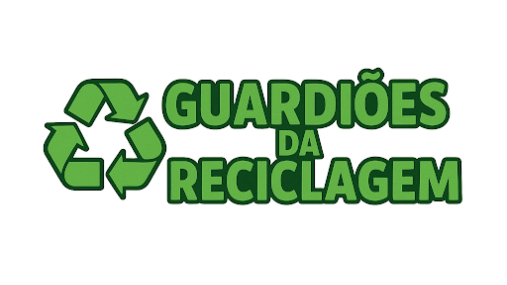

# 📖 Guardiões da Reciclagem - Site Interativo

Este site conta a **história do jogo Guardiões da Reciclagem** em formato de HQ, mostrando os personagens, fundadores e a missão de incentivar a reciclagem. Desenvolvido com **HTML, CSS e JavaScript**, proporciona uma experiência interativa e divertida para todas as idades.

---

## 🚀 Funcionalidades
- História em quadrinhos interativa sobre os Guardiões da Reciclagem.  
- Apresentação dos personagens e fundadores do jogo.  
- Layout responsivo e visualmente atrativo.  
- Navegação fluida entre seções da HQ.  

---

## 🛠️ Tecnologias Utilizadas
- **HTML5** → Estrutura do site  
- **CSS3** → Estilização, animações e efeitos visuais  
- **JavaScript** → Interatividade e navegação dinâmica  

---

## 📂 Estrutura do Projeto
